# Task Management App

Simple PHP task management application with authentication, task CRUD, status updates, sorting, pagination, and SweetAlert notifications.

## Features

- Register, login, and logout
- Add, edit, delete, and complete tasks
- Sort tasks by due date, description, and priority
- Today reminder alert
- SweetAlert validation and confirmation dialogs
- Pagination with 6 items per page

## Technology

- PHP version 8.4.16
- PostgreSQL
- HTML
- CSS
- JavaScript
- SweetAlert2

## Setup

1. Clone the repository.
2. Configure your database connection in `config/database.php`.
3. Import the database schema into PostgreSQL.
4. Run the project through your local PHP server.

## Project Structure

- `controllers/` - application controllers
- `models/` - database models
- `routes/` - routing entry points
- `views/` - page templates
- `css/` - stylesheets
- `js/` - client-side scripts
- `assets/` - screenshots used in this README

## Requirements Coverage

- User login and logout
- Task creation, editing, completion, and deletion
- Sorting by due date, description, and priority
- Today due-date reminder
- Adaptive UI for desktop, tablet, and mobile
- SweetAlert validation and confirmation dialogs
- English-only labels, messages, and notifications

## Application Flow

### 1. Register

The user creates a new account from the register page.

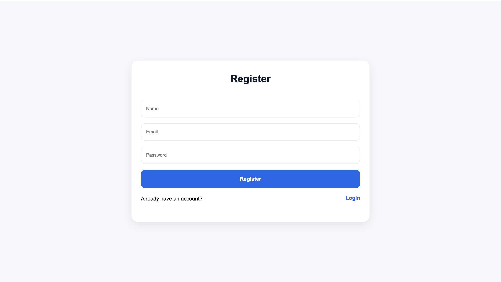

If any required field is empty, a SweetAlert error appears.

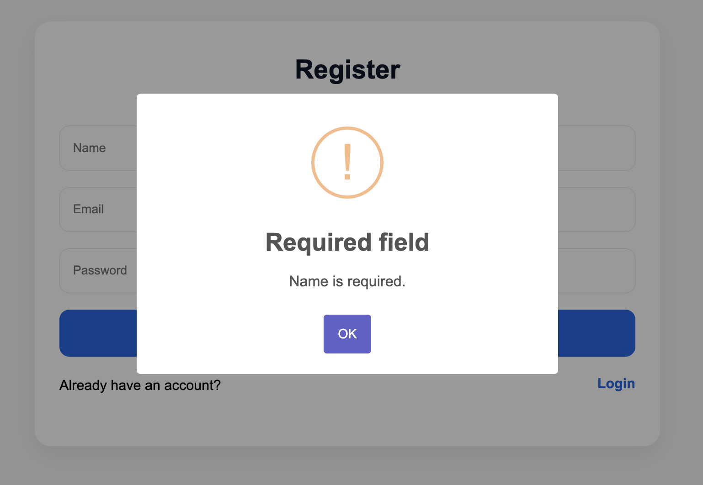

### 2. Login

The user signs in using the login page.

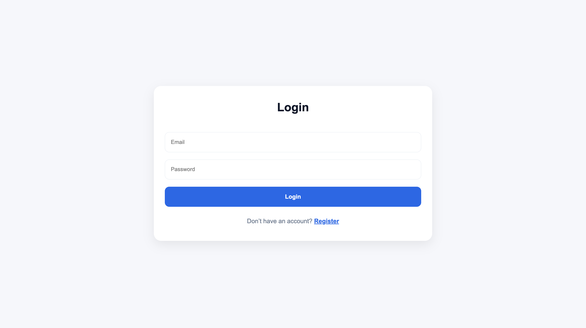

If the email field is empty, a SweetAlert error appears.

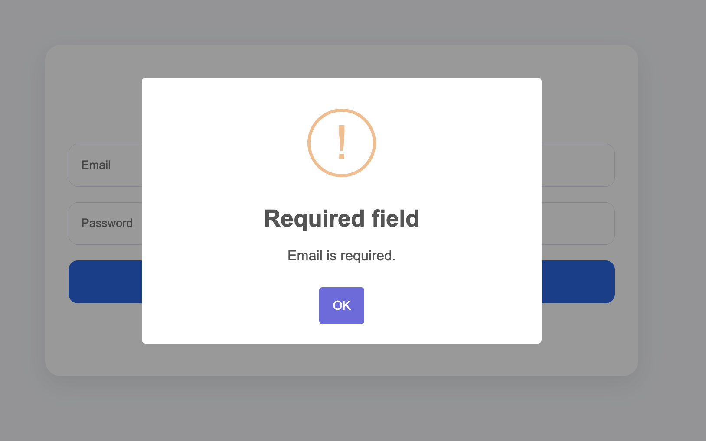

If the credentials are correct, the user sees a success alert after login.

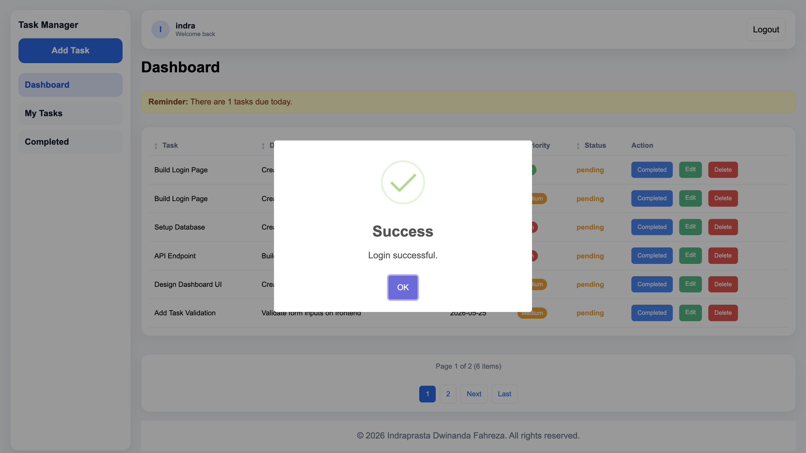

### 3. Dashboard

After login, the dashboard shows the task list and available actions.

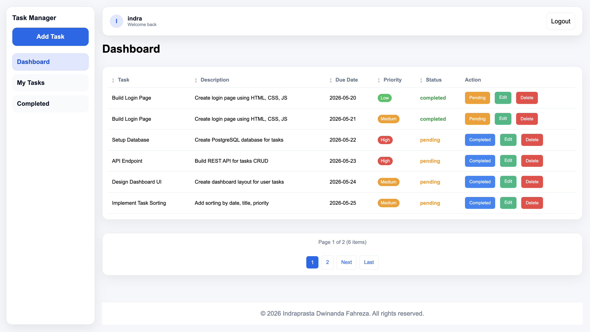

The dashboard supports task filtering:

- My Tasks

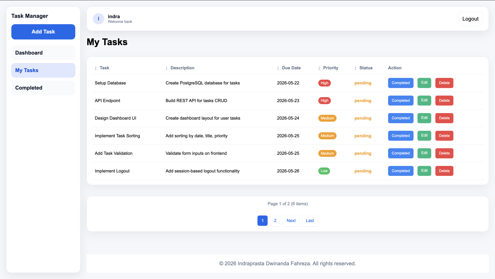

- Completed Tasks

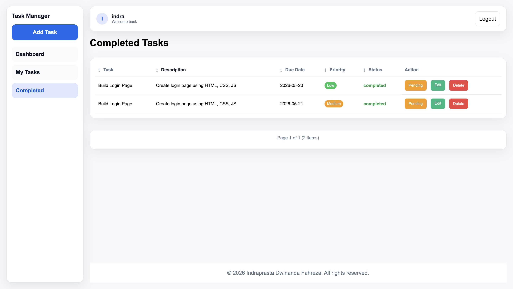

The table supports sorting by due date, description, and priority.

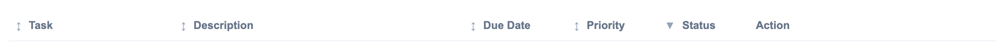

### 4. Add Task

The user can add a new task from the add task page.

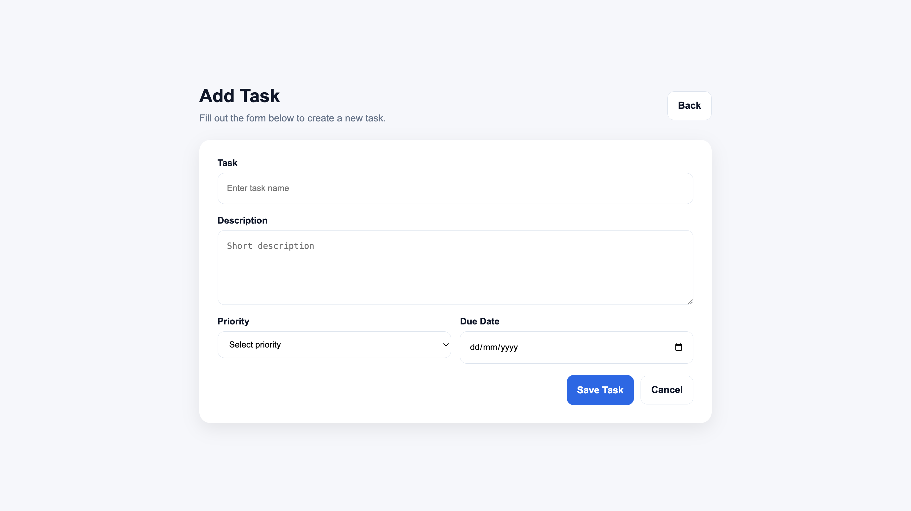

If required fields are empty, a SweetAlert error appears.

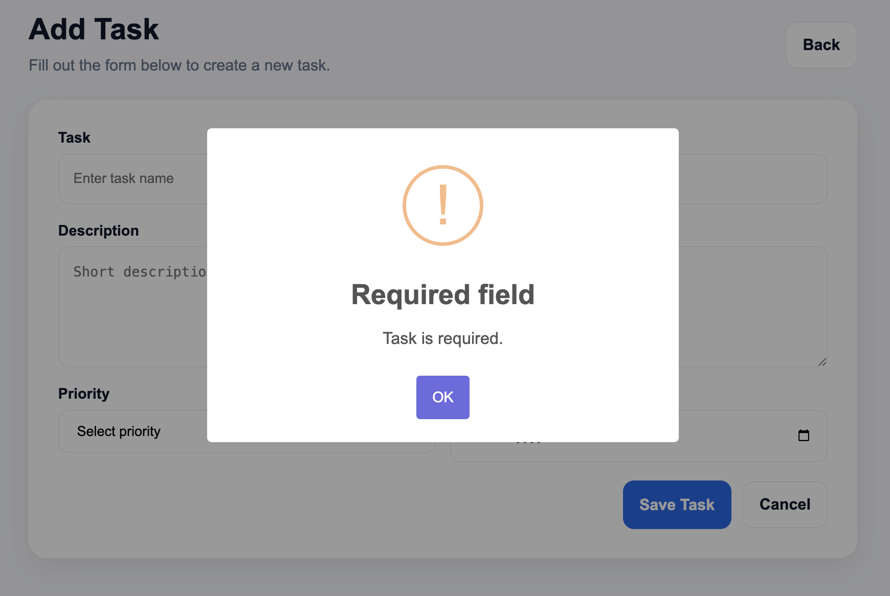

### 5. Edit Task

The user can edit an existing task from the edit page.

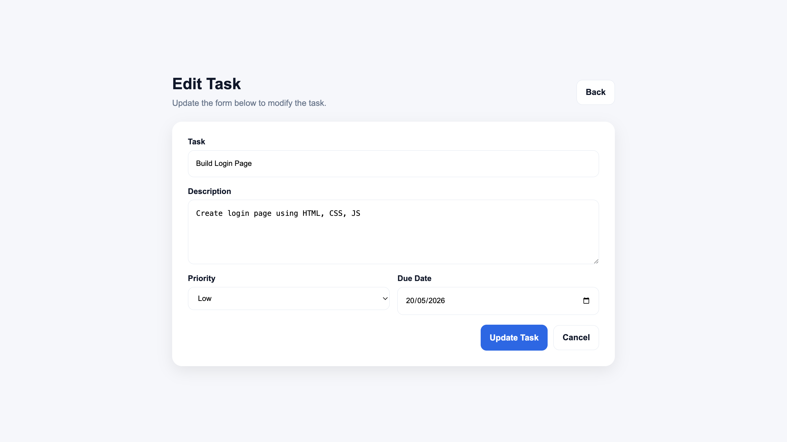

If required fields are empty, a SweetAlert error appears.

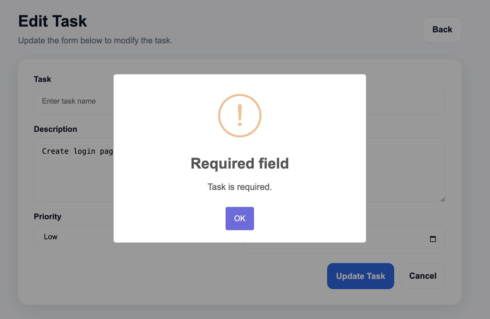

When the task status is updated, a success alert appears.

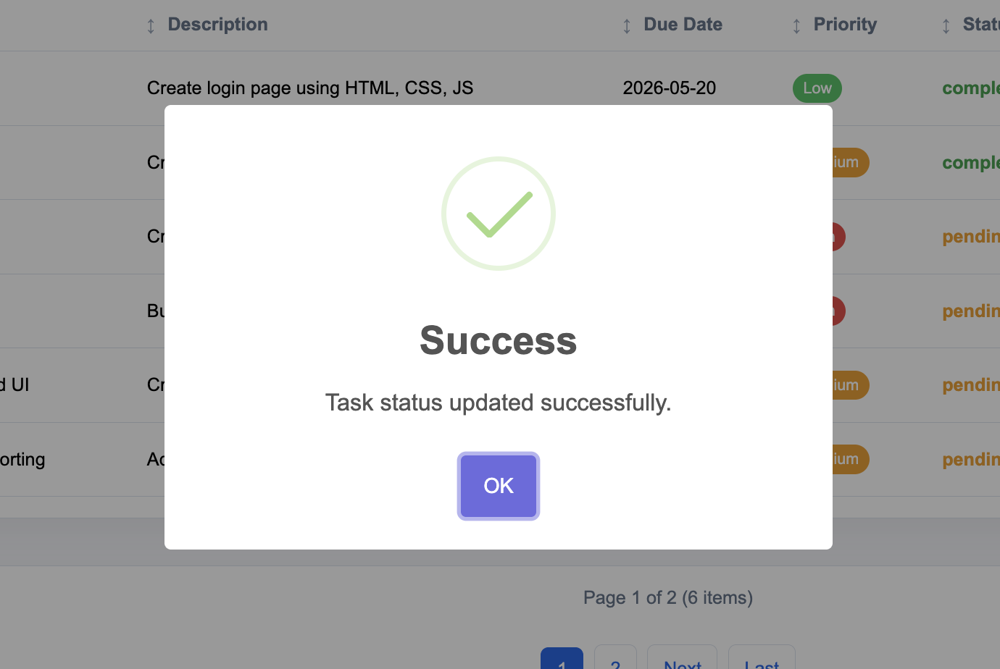

### 6. Delete Task

Before deletion, the app shows a confirmation dialog.

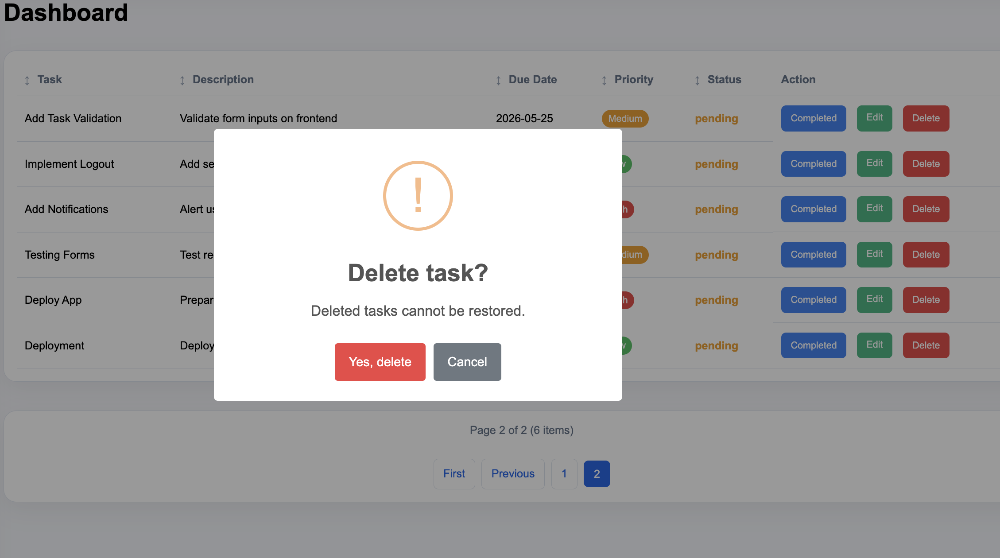

After deletion, a success alert appears.

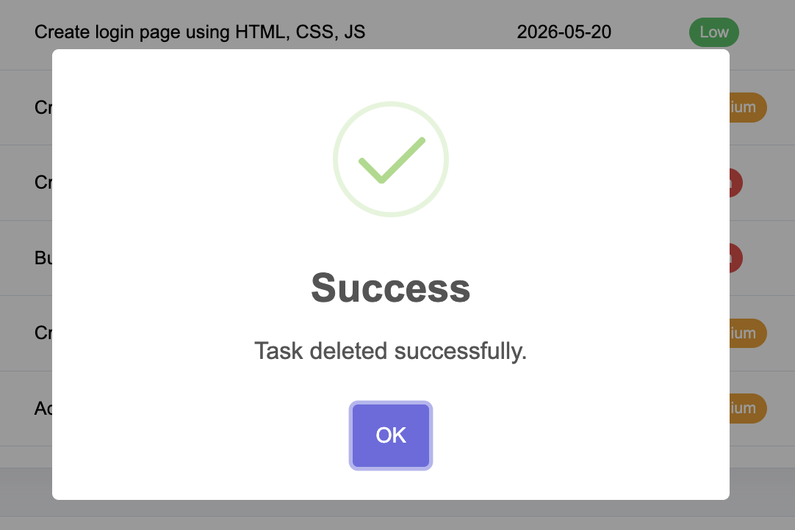

### 7. Logout

When the user clicks logout, the session is cleared and the app returns to the login page.

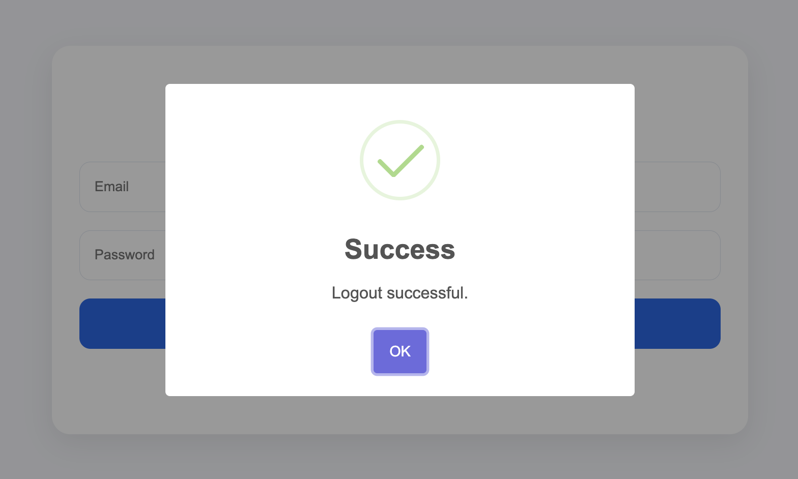

## Notes

- All UI text and notifications are in English.
- The screenshots above are available in the `assets` folder and arranged in flow order from register to logout.
- This README is organized to match the application flow from registration through logout for easier review.
